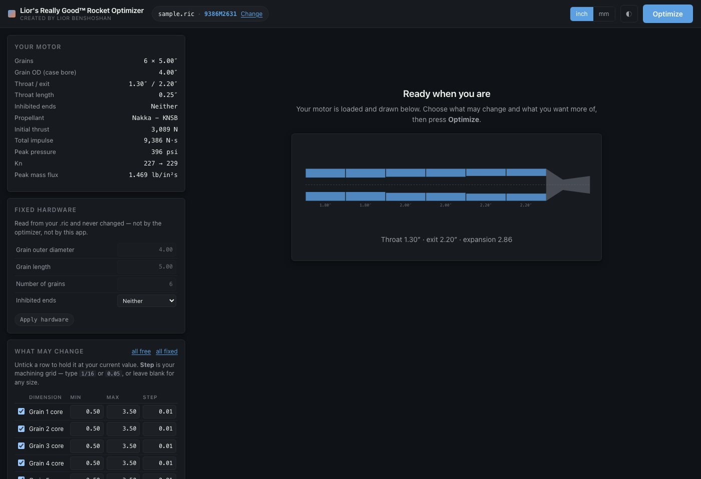

# Rocket Optimization

Lior's Really Good™ Rocket Optimizer, created by Lior Benshoshan.

A local web application that searches for solid rocket motor designs. It runs
[openMotor](https://github.com/reilleya/openMotor)'s internal ballistics engine
headlessly, evaluating thousands of candidate motors against a set of limits and
returning the ones that satisfy them. Results are exported as `.ric` files that open
directly in openMotor.

The application is built for BATES grain geometries.



The [field guide](docs/Optimizer-Field-Guide.pdf) documents the interface panel by
panel. Its [HTML source](docs/guide.html) is the file the PDF is rendered from.

## Installation

```bash
python3 app.py
```

The first run builds an environment before starting: a `.venv` in the project folder,
the packages listed in `requirements.txt`, and a clone of openMotor pinned to a known
commit. It asks for confirmation first and writes nothing outside the project folder.
The application then opens at `http://localhost:8420`.

Requirements are Python 3.9 to 3.12, and `git`. The upper version bound is a
consequence of the pinned dependencies: numpy, scipy and scikit-image publish wheels
up to Python 3.12 only, and later versions cause pip to attempt a source build. Setup
checks the version before installing anything, and will use a supported interpreter if
one is installed alongside a newer one.

A C compiler is optional. openMotor contains one compiled module that BATES
simulations never call. Without a compiler, setup substitutes a pure-Python stand-in
that raises an error if a grain geometry ever requires the real one.

To build the environment without the confirmation prompt, run `scripts/setup_env.sh`
or `python3 bootstrap.py --yes`.

## The motor

Whatever `.ric` file is placed in `motor/` is the motor that gets optimised. No
filename is significant. The folder ships empty and the application does nothing until
a motor is placed there, since a motor design belongs to whoever made it and not in
this repository.

For a motor to experiment with, `python tests/sample_motor.py motor/sample.ric` writes
a generic six-grain KNSB motor.

## What can be optimised

Grain outer diameter, length, count and the propellant are read from the `.ric` file
and never modified. Nine dimensions can be varied:

| Variable | Description |
|---|---|
| `core_1` … `core_6` | core diameter of each grain, numbered from the forward end |
| `throat` | nozzle throat diameter |
| `exit` | nozzle exit diameter, floored at 1.15 × throat |
| `throat_length` | nozzle throat length |

Each dimension takes a machining step, such as 0.01 in or 1/16 in. The optimiser only
returns values that fall on that grid. Bounds, objectives and limits are configured in
the application, with defaults taken from the `.ric` file's own `maxPressure`,
`maxMassFlux` and `minPortThroat` values.

Sixteen metrics are available as objectives. Each can be maximised, minimised or
driven toward a target value. Selecting two produces a trade-off curve rather than a
single result.

## How results are produced

Two search modes are available. The fast mode runs a genetic search directly against
openMotor. The trade-off mode samples the design space, trains surrogate models, runs
NSGA-II against those models, and then re-simulates the survivors.

Every design that appears in a result has been simulated in openMotor at the
verification timestep with all search-time safety margins removed. Surrogate models
influence which designs are proposed, never which are reported.

The search runs at a 0.01 s timestep and verification at 0.002 s. The two disagree
slightly and in different directions depending on the metric. Peak mass flux is a
finite difference and grows as the timestep shrinks, total impulse is an integral, and
pressure and Kn are invariant. `runner.timestep_bias` measures the ratio on the loaded
motor and adjusts the search-time limits accordingly, so that a design sitting on a
limit during the search still satisfies it after verification.

A single search is not guaranteed to find the global front, so a run divides its
budget across several independent searches and reports the non-dominated set of
everything they find. The budget and the number of searches are both configurable.
Population size and generation count are derived from them.

## Two properties that reduce the search space

Grain order does not affect the result. In openMotor's model, impulse, pressure and
burn time depend only on the multiset of core diameters and not on their arrangement,
which `scripts/verify_ordering.py` checks against the simulator. Order affects mass
flux and port/throat ratio, and both are most favourable with the largest core aft.
Cores are therefore stored sorted, which removes a 720-fold degeneracy.

Several quantities are closed-form. Port/throat ratio, initial Kn, propellant mass and
ignition chamber pressure are exact results for BATES geometry and are computed in
`design.py` rather than learned. Only quantities that require integrating the whole
burn are modelled. The application uses the same closed-form expressions to report the
size of the configured design space, and to rule out regions that no legal motor can
occupy before any simulation runs.

## Output

Each completed run writes a report to `reports/` as a PDF. The report is derived
entirely from the run: hardware and limits are read from the motor and the
configuration, and the trade-off curve and option tables are built from the verified
designs. A run that finds no legal design is documented in the most detail, including
which limit could not be met and, where burning area is closed-form, a proof that no
core diameter would have satisfied it.

A second document is available on request: one sheet per design on the trade-off
curve, packaged as a zip archive.

`outputs/` mirrors the most recent optimisation and nothing else. It is emptied and
rewritten on every run, so its contents always describe the motor that was just
optimised. It contains `result.json`, one `.ric` file per legal design, and the report
figures. None of it is source, and none of it is committed.


## Development

```bash
.venv/bin/python scripts/verify_ordering.py   # check the core-sorting assumption
.venv/bin/python -m pytest tests/ -q
```

## Licence

You must be forklift certified to use this repo lol
